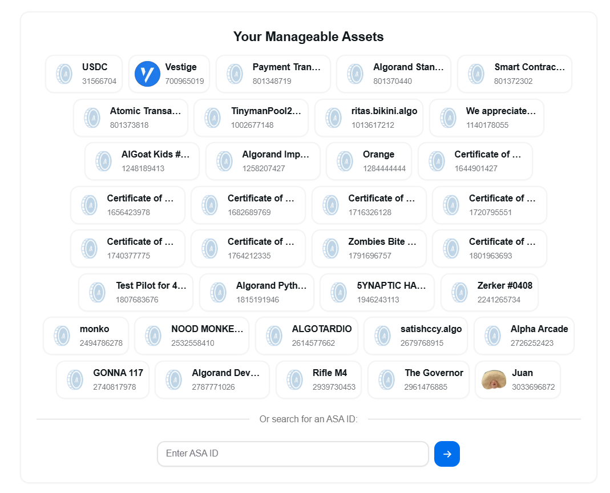
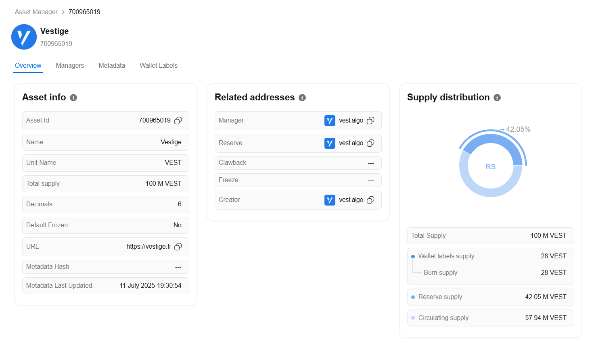
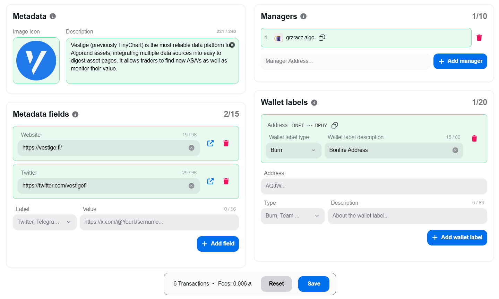
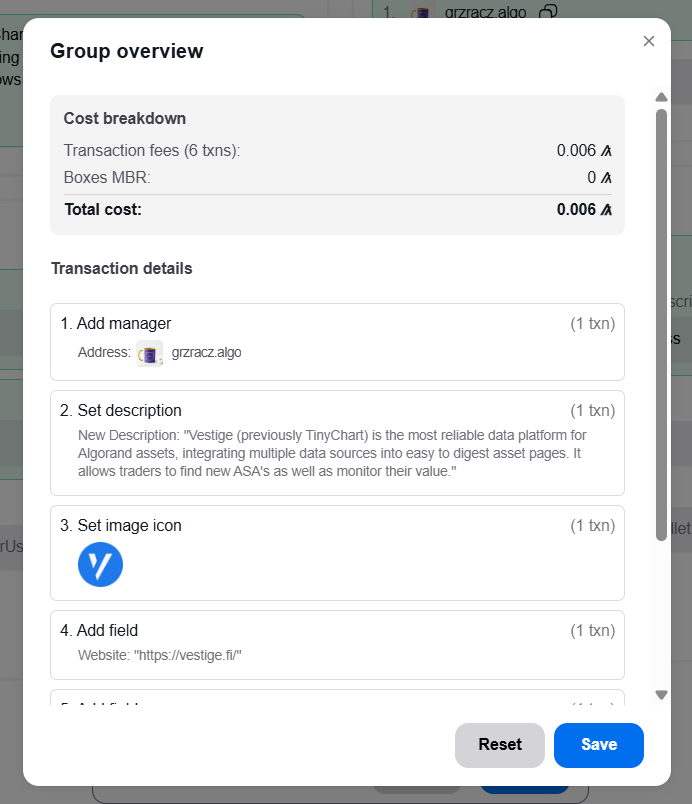

# For Asset Managers (User Guide)

This guide explains how to use the Vestige Asset Manager UI to update your ASA's on-chain metadata.

### 1. Finding Your Asset

First, navigate to the [Vestige Asset Manager](https://vestige.fi/asset-manager) and connect your wallet.

You will see a section titled **"Your Manageable Assets,"** which lists all assets in your wallet that you are authorized to edit. If you are editing an asset for the first time, you must be its Creator, Manager, or Reserve address.

*   Click on an asset from the list to begin editing.
*   Alternatively, you can enter an Asset ID in the input box below the list and click the arrow button.

This will take you to the main management page for your selected asset.

### 2. The Asset Management Page

The page is split into two main parts. First, you'll see a read-only overview of your asset, including **Asset Info**, **Related Addresses**, and **Supply Distribution**.

Below this, you'll find the sections you can edit: **Metadata (Icon, Description)**, **Managers**, **Metadata Fields**, and **Wallet Labels**.

**Note on First-Time Edits:** The first time you save a change for an asset, the contract performs a one-time setup to initialize it. At this time, the list of authorized managers is automatically populated with the asset's Creator, Manager, and Reserve addresses, along with the contract's admin, to ensure the key roles have access by default.

### 3. Managing Permissions (Managers)

In this section, you can grant or revoke editing permissions for other team members.

*   **Add a Manager**: Provide a new Algorand address to grant access. Only existing managers can add new ones. An asset can have a maximum of 10 managers.
*   **Remove a Manager**: Select an existing manager's address to revoke their access. You cannot remove the last manager.

### 4. Updating Your Asset's Profile (Metadata)

*   **Description**: Write a clear and concise description for your project (max 240 bytes).
*   **Image Icon**: Click the icon area to upload an image from your computer. This will be automatically uploaded to IPFS, and the URL will be set in the contract.

### 5. Labeling Project Wallets (Wallet Labels)

This feature is key to building community trust by providing transparency into your Asset's supply. You can label up to 20 wallets. For each label, provide:

*   **Address**: The Algorand address of the wallet you want to label.
*   **Type**: A category for the wallet. Common types include:
    *   `1`: Burn
    *   `2`: Team
    *   **Note**: We can add new types in future with indices up to `255`.
*   **Description**: A brief note about the wallet's purpose (e.g., "Team assets, vested for 2 years"). Max 60 bytes.

These labels are used to calculate the **circulating supply** according to the ARC-62 standard, providing a transparent and verifiable metric for your community.

### 6. Adding Social and Custom Links (Metadata Fields)

You can add up to 15 custom fields, which are perfect for linking to your project's official channels. For each field, provide:

*   **Label**: The type of link. Common labels include:
    *   `1`: Twitter
    *   `2`: Telegram
    *   `3`: Website
    *   `4`: Instagram
    *   `5`: Facebook
    *   `6`: Reddit
    *   `7`: Discord
    *   `8`: LinkedIn
    *   `9`: YouTube
    *   `10`: TikTok
    *   `11`: Farcaster
    *   `12`: Bluesky
    *   `13`: Threads
    *   `14`: Snapchat
    *   `15`: Pinterest
    *   `16`: Twitch
    *   **Note**: We can add new labels in future with indices up to `65535`.
*   **Value**: The full URL for the link (e.g., `https://twitter.com/vestige_fi`). Max 96 bytes.

### 7. Saving Your Changes

As you make changes, a floating bar at the bottom of the screen will show the number of transactions required and the estimated fees.

Click this bar to open a detailed overview of all your pending changes, including a breakdown of transaction fees and the minimum balance requirements for new on-chain storage (boxes). From here, you can save and sign the transactions to apply your updates or reset all changes.

